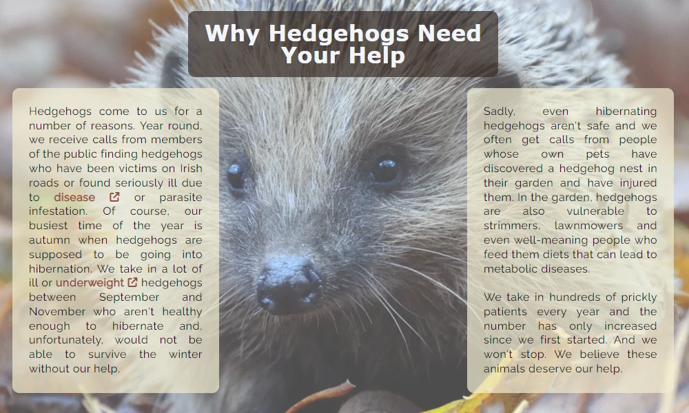
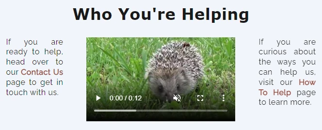
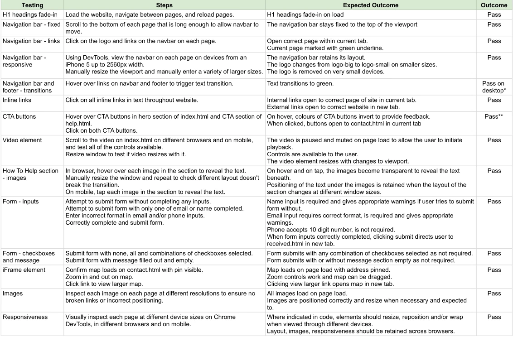

# The Hoggy Hospital
The Hoggy Hospital is a website for a fictional wildlife organisation that rescues and rehabilitates hedgehogs. The site targets people who are interested in learning about the organisaton, who may need their help in rescuing an injured animal, or who may wish to support the organisation in some way.

On the website, users can find information about the Hoggy Hospital. Users are told about its purpose and why its work is important, the ways that they can support the organisation, and information on how to contact it.

The live site can be found here: [The Hoggy Hospital](https://sjecollins.github.io/ci-pp1-hoggy-hospital)

# Table of Contents
- [User Experience](https://github.com/SJECollins/ci-pp1-hoggy-hospital#user-experience)
- [Features](https://github.com/SJECollins/ci-pp1-hoggy-hospital#features)
  - [Universal](https://github.com/SJECollins/ci-pp1-hoggy-hospital#universal)
  - [Index Page](https://github.com/SJECollins/ci-pp1-hoggy-hospital#index-page)
  - [Help A Hog Page](https://github.com/SJECollins/ci-pp1-hoggy-hospital#help-a-hog-page)
  - [Contact Page](https://github.com/SJECollins/ci-pp1-hoggy-hospital#contact-page)
  - [Received Page](https://github.com/SJECollins/ci-pp1-hoggy-hospital#received)
  - [404 Page](https://github.com/SJECollins/ci-pp1-hoggy-hospital#404-page)
  - [Future Expansion](https://github.com/SJECollins/ci-pp1-hoggy-hospital#future-expansion)
- [Design](https://github.com/SJECollins/ci-pp1-hoggy-hospital#design)
- [Technologies Used](https://github.com/SJECollins/ci-pp1-hoggy-hospital#technologies-used)
- [Testing](https://github.com/SJECollins/ci-pp1-hoggy-hospital#testing)
- [Deployment](https://github.com/SJECollins/ci-pp1-hoggy-hospital#deployment)
- [Credits](https://github.com/SJECollins/ci-pp1-hoggy-hospital#credits)

## User Experience
### User Story
Why a user may visit the website:

* To learn about the work the organisation does
* To contact or locate the organisation
* To find out if they can donate or contribute to the organisation in some way

What goals the organisation may have for the website:

* To reach a wide audience
* To encourage support from the public
* To provide information to users about the work they do
* To provide contact information to members of the public

## Features
### Universal
#### Navigation Bar
- The header element features a navbar that is used across all pages. It remains at the top of the screen as the user scrolls down the site so they can easily navigate to different pages on narrower devices without having to scroll back to the top to find navigation.
- On the right of the navbar are links to the three main pages of the website. On hover, the links transition to green to acknowledge the users interaction. The "active" page has a bottom-border in green to reflect which page the user is currently on.
- The navbar features a logo to the left side which navigates to the main page. On larger screens the logo features a hedgehog with text of the name of the organisation. On smaller devices, the logo is replaced with a simple hedgehog to maintain branding but provide space for the links. On very small screens, the logo is removed to allow the links to be easily accessed and prevent misclicking on small devices.
- The background colour is a dark brown and the text is in white to provide good contrast. The transition and bottom-border are in green as it an appropriate colour for the theme of the site and contrasts well with the brown.

  

#### Footer
- The footer element features social media links for the organisation. It features across all pages.
- The links feature a similar transition to green as the navbar.

### Index Page

The first page comprises four sections that introduce the user to the organisation, provide information about work of the organisation, and features a video accompanied by a call to action and an invitation to explore the website further.

#### Hero Image - index.html
- The hero section contains a large hero image of a hedgehog overlaid by the title of the website and organisation.
- The title features an ease-in transition when the page loads to draw the users eye.
- The section contains a call-to-action contact button below the title. Although the contact page is easily visible on the navigation bar, the button being immediately displayed in the header means the user can find contact information quickly. The button is styled in a dark red colour taken from the hero image itself with text in white. On hover, the button's colour scheme is inverted.

  

#### About Section
- The about section features three short paragraphs of text giving the user an introduction to the organisation. These paragraphs are intentionally short so as not to overload the user with information immediately on arrival and to encourage the user to keep reading. 
- The section is styled such that on large screens the paragraphs display as a row, but wrap to fit beneath each other on smaller devices.
- The text contains inline links to the How To Help page and Contact Us page, where appropriate. These are styled in the sam dark red colour as the CTA button in the Hero section.

#### Why Help Hedgehogs Section
- This section provides information to the user about the reasons animals come into the care of the organisation. This serves to provide motivation for the user to become emotionally invested in the work the organisation undertakes.
- The section is styled with a background image which appears as the user scrolls down so that as the text information comes into focus, so too does the hedgehog's face. This also is aimed at appealing to the user to become emotionally invested while rewarding them with a cute image as they scroll down the page. The background image also serves to break up the page into sections.

  

#### Who You're Helping Section
- The video element with accompanying text serves as a call to action. 
- The video provides controls to allow the user to initiate playback and is muted on load so the user won't be surprised by any unexpected noise. It is a simple video aimed at appealing to the users desire to see cute animals and could easily be substituted in a real wildlife organisation with a real video of a rescued animal.
- The text accompanying the video includes inline links to the How To Help page and Contact page to encourage the user to engage further with the website now that they have reached the bottom of the first page.

  

### Help A Hog Page

The second page of the site is similarly comprised of four sections. It focuses entirely on encouraging the user to support the organisation and features interactivity to engage the user.

#### Hero Image - help.html
- To match the first page, the first section contains a hero image as well. This provides an opportunity to reward the user with an appealing image of a hedgehog for visiting further into the page.

#### Help Introduction Section
- Comprised of text and an accompanying image, the introductory section of this page encourages the user to support the organisation by giving a summary of the ways available to help.

#### How You Can Help Section
- This presents the three main means of help that the organisation accepts.
- It is styled on a light background that highlights the images as important features and separates them from the sections above and below. The three images are styled to wrap on smaller devices while remaining centered on the page. Using the hover pseudoclass, the user can interact with the images so that the image transitions to text specific to the option they are interacting with. 

  

#### CTA Section
- At the bottom of the page is a simple call-to-action section. At this point, the user has presumably explored all the previous sections of the site and been presented with information about the organisation's work and the ways the user can help. They are invited by a question in the title and a large button element to contact the organisation.
- The button element is styled similarly to the CTA on the index.html hero section, though slightly larger as it is the focus for the user here. When hovered over, the button style changes to give feedback to the user.

### Contact Page
The third page of the website contains all the relevant information that the user may need to contact or locate the organisation. It is presented as three simple, similarly styled boxes or cards over a large background image of a hedgehog. The emergency contact always remains on top and centered horizontally. On large screens the form and location elements are displayed in a row below, with the location element wrapping below the form on small screens.

#### Emergency Contact
- Horizontally aligned centrally with a large heading, the first element presented to the user is the phone number to contact in case of an emergency. One of the main reasons a user may visit a wildlife rescue organisation's website is to find contact information in the case that they have found an injured animal, so this information is provided first and clearly labelled.

#### Contact Form
- The second element is the form element for a user to use to contact the organisation. The only required inputs are the name and email address. There is an option to include their phone number for contact purposes, but it is not required in the case the user is not comfortable providing that information. The user has the option to select checkboxes to identify if and how they would like to support the organisation. The user also has the option to include a message in the textarea element.
- Currently, the form opens a new tab to confirm receipt of the submitted form.

  

#### Location
- The third element contains the location information for the organisation. This includes an iframe element with the organisation's location pinned on the map so users can easily find it.

  

### Received
This page serves to provide feedback to the user when they click submit on the form element. They are directed to a page containing simple text and the navigation and footer elements to allow them to navigate to the main site. This page is not accessible through the navigation element as it is not intended for the user to see it unless they have completed the form. 
- With only HTML and CSS, I was unable to submit the form information using POST to https://formdump.codeinstitute.net/ and at the same time redirect to a confirmation page. I discussed with my mentor and we decided it was acceptable in this case to stay as strictly within the HTML and CSS restrictions as possible.

### 404 Page
On the suggestion of my mentor, I have added a 404 error page to the site. It is very simply styled and features a button directing to the home page, with the same styling as the CTA buttons found on the main site. 

### Future Expansion
As a wildlife rescue website, there are a variety of features that could be implemented in the future.
1. A direct donation link. This could be connected to the organisation's PayPal account or similar, allowing the user to donate directly on the page, quickly and easily.
2. A blog. It provides further user engagement and encourages users to return. Users of these types of sites enjoy learning more about individual rescue cases. It can also be used to direct views from social media to the site, for example, through short synopses on Facebook or Instagram with links encouraging the user to read the blog for the full story. Similarly, it can direct views to the organisations social media sites, e.g. by linking to their videos on YouTube.
3. A gallery. This could comprise solely of pictures of the animals rescued or include the facilities or staff of the organisation, creating a more personal connection with the user.
4. An online shop. An online shop with options to purchase limited branded merchandise (e.g. mugs, stickers, etc.) or sponsorship of an animal could be implemented as a means of fundraising, branding or to encourage user engagement.

## Design
### Imagery
On an animal related website, users expect visual content of animals so the site was designed around including a large amount of images of hedgehogs. The images are chosen for being clear, close up images that invoke a positive responsive in the user. All but two sections of the site contain an image or video of a hedgehog to encourage and reward the user for exploring the site.
- The navigation logo was drawn in Inkscape. On large devices, it includes the name of the hospital. On smaller devices, the text is removed but the logo remains. On very small devices, unfortunately it was decided to remove the logo to allow space for the links. The logo is a very simple design, easily recognised as a hedgehog at different sizes.
- The hero images were chosen for being large quality, close up images. The positioning of the hedgehogs in the images gives the impression of them approaching or looking to the headings in the hero sections.
- Linear-gradients were applied in the CSS to the background image on the Why Help Hedgehogs section of the index age and the background image of the contact page. This improved readability of the text over the images but still allowed them to be viewed clearly. 
- The images used on the website were edited in Gimp and exported as webp to reduce size. The large background of the contact page was compressed using TinyPNG to improve performance.

### Colour
The colours used were sampled from the hero image on the index page. They include a dark brown, dark red, green, light yellow and off-white. A black was used for text that was chosen separately. The colours were chosen to convey an overall earthy and natural feel. Several were tested for readability until the final selection were decided. It was decided not to use to many or too vibrant colours and to allow the imagery to be the focus.

### Typography
Google Fonts was used to import the Raleway font to style.css to be used as the main font. Verdana was chosen for headings. These simple sans-serif fonts were selected as they are quite easy to read and not distracting for the user. A small increase in line height and letter spacing in style.css improved readability. Font sizes were styled to change across screen sizes. 

### Buttons and Links
- Links in the header and footer were styled white with a green fade-in transition to provide feedback to the user when they were interacting with the links. 
- Inline links and buttons were styled similarly to each other. It was decided on a dark red colour to style both so as not to confuse the user. The colour chosen as it was easily readable without being too distracting. Inline links were given an increase in font weight to stand out further from surrounding text. CTA buttons and the submit button on the contact form were styled with white text on the dark red. This inverts when hovered over to provide feedback to the user that they are about to interact with an element.

### Wireframes
Wireframes were created in Balsamiq.
- Home Wireframe

- Help A Hog Wireframe

- Contact Us Wireframe

### Mockups
Mockups were created in Gimp to visualise the layout with images in place and experiment with colours. The final colours and were not decided until the website was tested with Lighthouse.

## Technologies Used

- [HTML5](https://en.wikipedia.org/wiki/HTML5): mark-up language.
- [CSS3](https://en.wikipedia.org/wiki/CSS): styling.
- [GIT](https://git-scm.com/): for version control.
- [GitHub](https://github.com/): for host repository.
- [Gitpod](https://www.gitpod.io/): online IDE.
- [Google Fonts](https://fonts.google.com/): to import fonts.
- [Font Awesome](https://fontawesome.com/): to import icons.
- [Balsamiq](https://balsamiq.com/): to create wireframes.
- [GIMP](https://www.gimp.org/): to edit images, create a mockup and select colours.
- [Inkscape](https://inkscape.org/): to create the logo.
- [TinyPNG](https://tinypng.com/): to compress images.

## Testing

### [HTML Validator](https://validator.w3.org/)
- Index.html:
  - 
  - [Link to HTML Validator](https://validator.w3.org/nu/?showsource=yes&showoutline=yes&showimagereport=yes&doc=https%3A%2F%2Fsjecollins.github.io%2Fci-pp1-hoggy-hospital)
- Help.html:
  - 
  - [Link to HTML Validator](https://validator.w3.org/nu/?showsource=yes&showoutline=yes&showimagereport=yes&doc=https%3A%2F%2Fsjecollins.github.io%2Fci-pp1-hoggy-hospital%2Fhelp.html)
- Contact.html:
  - 
  - [Link to HTML Validator](https://validator.w3.org/nu/?showsource=yes&showoutline=yes&showimagereport=yes&doc=https%3A%2F%2Fsjecollins.github.io%2Fci-pp1-hoggy-hospital%2Fcontact.html)
- Received.html:
  - 
  - [Link to HTML Validator](https://validator.w3.org/nu/?showsource=yes&showoutline=yes&showimagereport=yes&doc=https%3A%2F%2Fsjecollins.github.io%2Fci-pp1-hoggy-hospital%2Freceived.html)

### [CSS Validator](https://jigsaw.w3.org/css-validator/)
- Results for style.css:
  - 
  - 

        
    

     

### Lighthouse
The site was tested used Lighthouse in Chrome DevTools throughout the development to check performance, accessibiltiy, best practices and SEO. This testing informed the decision on the final choice of colours. Using Lighthouse, it was decided to change the images from .png to .webp and compress certain images to improve performance. The final test on Lighthouse was run on incognito mode and these are the results:

### Browser Compatibility
The website was tested on:
- Chrome Version 101.0.4951.67
- Firefox Version 101.0.4951.67
- Edge Version 101.0.1210.53
- Safari iOS Version 15.4.1 on an iPhone 8
- Internet Explorer was tested and did not work as intended (images and colours did not load properly, positioning of elements was incorrect), but as the browser is retiring on the 15th of June this year, it was decided not to spend time adapting the site for this browser.

### Testing Functionality

  *_The :hover pseudoclass does not function on mobile the way that it does on desktop and so the transition effect was not expected to work on mobile_

  **_As above, the :hover pseudoclass was not expected to function on mobile. The button colours do invert when tapped on mobile_

### Testing User Story
- Users who are visiting the website to learn about the organisation. 
  - Users are presented with an about section immediately below the hero image on the main page. This leads into a section about the work is important, and so on. The information is presented in clear and concise sections. The flow of the website encourages the user to continue exploring. The user is continuously presented with imagery that illicits a positive response in the user as they browse the site. The user always has at least one method of navigation at hand so that they can find the information they require.
- Users who are visiting the website to contact or locate the organisation.
  - Immediately on arriving on the main page and without having to scroll there are two available elements that link to the contact page - the link to the contact page on the right of the navigation bar and the large "Contact Us" button predominantly displayed below to page heading.
  - The contact page contains three methods for the user to contact the organisation:
    1. Emergency contact - prominantly displayed at the top of the page to draw attention
    2. Contact form - in cases which are less urgent. For example, if a user would like to volunteer there time or if they have a question that doesn't require an immediate response.
    3. Location information - for cases where a user may need to send something by post or attend the organisation physically, such as dropping off an injured animal.
  - Also available on the website are the social media links in the footer. These can be found across all pages so users are able to contact or follow the organisation on any of their social media accounts.
  - In the case that the user is visiting the website for another reason, but decides at some point that they would like to contact the organisation there are inline links at points in the text and another "Contact Us" button at the bottom of the Help A Hog page. 
- Users who wish to support the organisation.
  - On landing on the main page, users are presented with the "Contact Us" button which brings them to the contact form where they can register their interest in how they would like to support the organisation.
  - From the navbar, users can find the Help A Hog page that provides them with information about the ways they can support the organisation.
  - Inline links in other sections of the page are present to guide users to the support and contact pages.
  - The CTA section at the bottom of the Help A Hog page presents a direct call to action with its presentation, asking users directly if they are "ready to help?"
  - In the footer, present on all pages, users are provided with social media links in the case that they would like to support the organisation on their other platforms.

### Fixed Bugs
- Header logo
  - The logo in the header created an issue where on smaller screen widths, it pushed the links out of line.
  - A hamburger menu was considered but to stay (as much as possible) within the project parameters of only using HTML and CSS, it was decided to change the logo on smaller devices to a simple hedgehog and, on very small screens, remove the logo altogether to allow the links to stay in one line.
- Contact page background
  - Initially on deployment, the background image of the contact page was not filling very large screens and the footer was displaying in the centre of the screen. It was related to the viewheight of the screen.
  - The background image was given a min-height of 100vh.
- How To Help images not responding on mobile
  - The :hover psuedoclass used on the images and text on the section does not work on mobile.
  - A :active psuedoclass was added for mobile. Additionally, the code was reworked to remove the transition on the text and the opacity transition is now only applied to the images. The text was repositioned using the z-index. This made the code smaller and simpler.
- On very large screens, the layout became very stretched and unpleasant to navigate.
  - A max-width was applied to the body element and it was centered to prevent the layout from becoming distorted.

### Known Bugs
- The website does not load correctly on Internet Explorer.
  - The browser is being retired on 15/06/22 so it was decided not to use time on trying to adapt the site to it.

## Deployment
### Steps to deploy site:
- In the GitHub repository, navigate to the "Settings" tab.
- Scroll down to "Pages" in the menu on the left hand side.
- Under the heading "Source", click the drop-down menu and select "main" branch.
- The page will automatically refresh with a link to the deployed website.
- It may not go live for a few minutes, refresh the page to update the link.

The live site can be found here: [The Hoggy Hospital](https://sjecollins.github.io/ci-pp1-hoggy-hospital)

## Credits
### Code
- The code for the navigation underline on an active page is from the Code Institute [Love Running Project](https://github.com/Code-Institute-Solutions/love-running-2.0-sourcecode)
- The code for the h1 fade-in animation is based on this [GeeksforGeeks Tutorial](https://www.geeksforgeeks.org/how-to-create-fade-in-effect-on-page-load-using-css/)
- The use of min() and clamp() for responsive resizing of some elements, particularly headings, was based on [this tutorial by Kevin Powell](https://www.youtube.com/watch?v=U9VF-4euyRo&t=844s&ab_channel=KevinPowell)
- The use of Flexbox for the help.html intro section was based on [this tutorial by Kevin Powell](https://www.youtube.com/watch?v=bn-DQCifeQQ&t=1769s&ab_channel=KevinPowell)
  - More broadly, the site implements Flexbox liberally, inspired by experimenting after this tutorial
- The code to reduce opacity of the images over text when hovered over is based on: [Crossfading images](http://css3.bradshawenterprises.com/cfimg/)
- The linear-gradient over background images to improve readability is based on the response to this [question on Stack Overflow](https://stackoverflow.com/questions/4997493/set-opacity-of-background-image-without-affecting-child-elements)
- The embedded google map is based on code from [Maps.ie](https://www.maps.ie/create-google-map/)
- The code to add the 404 page is based on [this video by Dani Krossing](https://www.youtube.com/watch?v=kPtS4vO42II&ab_channel=DaniKrossing)

### Media
- Icons for contact.html and the external links on index.html are from [Font Awesome](https://fontawesome.com)
- The Raleway font was imported from [Google Fonts](https://fonts.google.com)

- Images from [Unsplash](https://unsplash.com):
  - [Help Intro Hedgehog](https://unsplash.com/photos/tP55Wb-eLNw) by Fabian Fromwald
  - [Volunteer Hedgehog](https://unsplash.com/photos/iwFbKbfPGNk) by Tadeusz Lakota
  - [Sponsor Hedgehog](https://unsplash.com/photos/FN0RjBugxMA) by Jana Vukomanovic
  - [Reasons Section Background](https://unsplash.com/photos/GXMr7BadXQo) by Piotr Laskawski
  - [Contact Page Background](https://unsplash.com/photos/OMCgkp1oZ3Q) by Alexas_Fotos
- Images from [Pixabay](https://pixabay.com):
  - [Help Hero Image](https://pixabay.com/photos/hedgehog-child-young-hedgehog-1701544/) by Alexas_Fotos
- Image from [Pexels](https://pexels.com):
  - [Index Hero Image](https://www.pexels.com/photo/brown-hedgehog-on-green-grass-3894108/) by Daniel Sillifant
  - [Donate Hedgehog](https://www.pexels.com/photo/brown-and-black-hedgehog-standing-on-brown-dry-leaved-134061/) by monicore
- Video from [Pexels](https://pexels.com):
  - [Hedgehog Video](https://pixabay.com/videos/hedgehog-grass-go-animals-nature-4250/) by klimkin